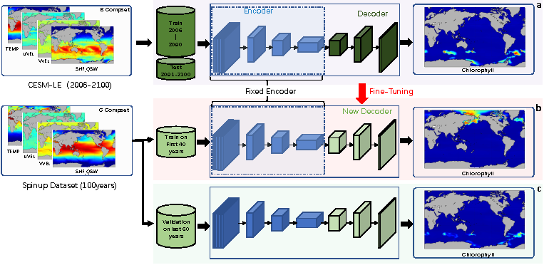
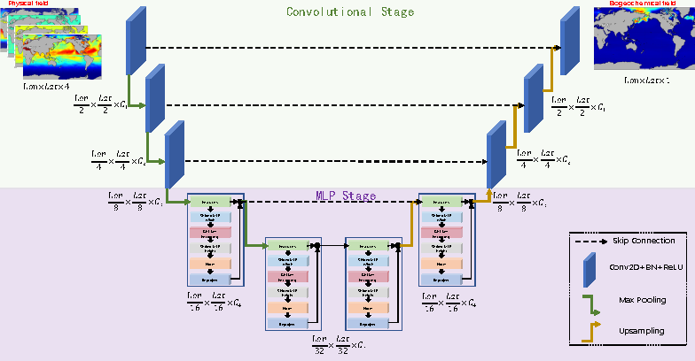

# BGC-UNet

## Overview

This repository contains the code and data corresponding to our accepted manuscript titled “[Neural Emulator based on Physical fields for Accelerating the Simulation of Surface Chlorophyll in an Earth System Model](#)”, accepted in **Ocean Modeling**. The study presents **BGC-UNet**, a neural network emulator designed to predict ocean surface chlorophyll concentrations based on physical fields from the Community Earth System Model (CESM).

Simulating the ocean biogeochemical module (BGC-enabled) in CESM is computationally expensive, often requiring significantly more resources than the physical climate component. **BGC-UNet** offers an alternative approach by efficiently generating biogeochemical data, thereby accelerating Earth system modeling.

## Authors

- **Bizhi Wu**1,†
- **Shiyao Zheng**1,†
- **Shasha Li**1
- **Shanlin Wang**1,*

1 State Key Laboratory of Marine Environmental Science & College of Ocean and Earth Sciences, Xiamen University, Xiamen, 361102, China  
† These authors contributed equally to this work.  
* Corresponding author: shlwang@xmu.edu.cn

## Abstract

Simulating the ocean biogeochemical module (BGC-enabled) in the Community Earth System Model (CESM) is computationally expensive, often requiring significantly more resources than the physical climate component. In this study, we propose an alternative approach to generate biogeochemical data using a neural network emulator, **BGC-UNet**, which predicts ocean surface chlorophyll concentrations based on physical fields from CESM, such as solar short-wave heat flux (SHF-QSW), potential temperature (TEMP), and zonal and meridional velocity (UVEL, VVEL).

**BGC-UNet** is designed as a UNet-like architecture and employs a patch-based methodology with dilated sampling to efficiently reconstruct biogeochemical data from physical inputs. This framework potentially enables high-resolution chlorophyll predictions without running full BGC-enabled simulations.

Our evaluation demonstrates that **BGC-UNet**’s outputs closely align with CESM’s simulated surface chlorophyll, supported by both quantitative metrics and visual analysis. Additionally, the emulator achieves a simulation speed approximately 248 times faster than traditional BGC-enabled CESM simulations. Although the current focus is on surface chlorophyll, the model shows potential for future extension to other biogeochemical variables.

By leveraging only 40 years of simulated data for training, **BGC-UNet** replicates the trends observed in CESM, making it a promising tool for accelerating Earth system modeling.

## Project Description

**BGC-UNet** serves as a neural emulator to accelerate the simulation of ocean surface chlorophyll in the Community Earth System Model (CESM). The primary goal is to reduce the computational burden associated with BGC-enabled simulations by predicting chlorophyll concentrations based on readily available physical fields.

### Key Contributions:
- **Neural Network Emulator:** Introduces a UNet-like architecture tailored for biogeochemical data reconstruction.
- **Efficiency:** Achieves a significant speed-up (≈248x) compared to traditional BGC-enabled CESM simulations.
- **Scalability:** Potential for extension to other biogeochemical variables beyond surface chlorophyll.

## Figures

### 1. Training and Validation Processing of BGC-UNet for Surface Chlorophyll

*Figure 1: The training and validation processing of BGC-UNet for surface chlorophyll.  
(a) **Model Pre-Training:** Training model on CESM-LE datasets to get the initial weights.  
(b) **Model Fine-Tuning:** We first procure BGC-enabled G compset data spanning several model years. The model, pre-trained on CESM-LE datasets, is then fine-tuned using this data. The physical fields serve as the inputs, while the corresponding chlorophyll fields from the same simulation periods act as the constraints of BGC-UNet outputs (ground-truth).  
(c) **Model Generation:** Data from the physics-only G compset are fed into the fine-tuned model, which then specifically generates the output of chlorophyll fields. (As previously noted, we utilize the physical fields directly from the BGC-enabled G compset data.)*

### 2. Detailed Architecture of the BGC-UNet Model

*Figure 2: Detailed architecture of the BGC-UNet model. BGC-UNet is based on the UNeXt architecture, which is an encoder-decoder framework with two main stages:  
1) **Convolutional Stage:** Extracts spatial features using convolutional blocks.  
2) **Tokenized MLP Stage:** Processes spatial features with Shifited MLP (Width), GELU+Encoding, Shifted MLP (Height), Norm, and Project blocks to enhance spatial locality and overall model understanding.*

## Features

- **UNet-like Architecture:** Efficiently captures spatial dependencies in biogeochemical data.
- **Patch-Based Methodology:** Enhances model performance with dilated sampling.
- **High-Speed Simulation:** Achieves up to 248x faster simulations compared to traditional CESM BGC-enabled runs.
- **Extensible Framework:** Potential for future expansion to other biogeochemical variables beyond surface chlorophyll.
  
## Datasets

the data post-processing scripts and associated resources can be found at \url{https://pan.baidu.com/s/12eivQECCHlB2JH22e8HAkw?pwd=a9rx} with the code: a9rx.

## Installation

TBD

## Usage

TBD

## Results

- **Accuracy:** The emulator's predictions closely match CESM's surface chlorophyll concentrations based on quantitative metrics and visual inspections.
- **Performance:** Achieves a simulation speed approximately 248 times faster than traditional BGC-enabled CESM simulations.
- **Training Data:** Utilizes 40 years of simulated data to effectively replicate CESM trends.

## Supplementary Materials

This repository provides supplementary materials for the associated manuscript, including more detailed experimental results, tables, and additional figures. These materials offer deeper insights into the model's performance and validation processes.

## Contributing

Contributions are welcome! Please fork the repository and submit a pull request for any enhancements or bug fixes. For significant changes, please open an issue first to discuss the proposed modifications.

## License

This project is licensed under the MIT License. See the [LICENSE](LICENSE) file for details.

## Contact

For any inquiries or further information, please contact:

**Bizhi Wu**  
Email: [wubizhi@xmu.edu.cn](mailto:wubizhi@xmu.edu.cn)
